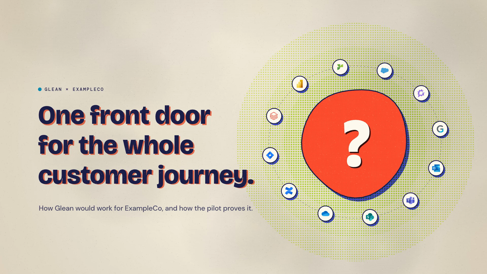

# Glean Risograph Editorial Explainer Video Kit

Create polished narrated videos in a consistent risograph-inspired editorial style: warm paper, halftone ink, bold typography, tactile sound, and diagram-led storytelling.

**Story → Visual design → Narrated video**

> [!IMPORTANT]
> **Use Opus 5.5 in Glean Tau for this workflow.** Select Opus 5.5 before asking Tau to download the kit and begin the project.

<p align="center">
  
</p>
<p align="center"><sub>Sanitized ExampleCo sample frame rendered with the included video engine.</sub></p>

> [!NOTE]
> **No coding is required.** Give Glean Tau the repository, your source material, and the outcome you want. Tau guides the work and pauses for your approval between phases.

Use it for:

- **General explainers** that teach a durable Glean idea, capability, workflow, or point of view.
- **Customer-specific videos** that turn approved account context and use cases into a co-branded story.
- **Undecided projects** where Tau researches the context and recommends the strongest direction before story approval.

---

## Workflow at a glance

| 01 · Story | 02 · Visual design | 03 · Production |
|---|---|---|
| Tau uses your rough idea, freeform notes, supplied sources, and optional Glean research to shape the story. | Tau creates the visual metaphor, scene plan, on-screen copy, logos, and style frames. | Tau creates the spoken script, ElevenLabs narration, animation, audio, captions, and final render. |
| **You approve:** project type and story | **You approve:** the visual storyboard | **You approve:** the finished video |

> [!TIP]
> You can stop after any phase, give feedback, and resume later. Tau records progress and approvals in `project/STATUS.md`.

---

## Fastest way to use this in Glean Tau

### 1 · Ask Tau to download and prepare the kit

Start a Glean Tau chat and paste:

> Clone `https://github.com/mike-koscak-glean/glean-risograph-explainer-video-kit` to my computer. Create a new video project named `my-video` in **undecided** mode. Do not start writing the video yet.

If you already know the type, replace **undecided** with **general** or **customer**. Undecided mode lets Tau research the context and recommend the strongest direction. Tau will create an independent project in `videos/my-video/`.

### 2 · Continue in the same chat

Tau can work from the generated folder without opening a new chat or reloading. In the same conversation, paste:

> Continue working from the `videos/my-video/` folder you just created. Read and follow `.glean/skills/risograph-explainer-workflow/SKILL.md` from that project. Start with the story phase. Use my notes and sources, and search Glean when I request it. Do not move to the next phase until I approve the current one.

Tau will use the generated project as its working location and begin the guided workflow there.

### 3 · Start with whatever context you have

You do **not** need to complete a questionnaire. Begin with any combination of:

- **A rough idea:** “Make a general explainer about how Glean permissions work.”
- **A Glean research request:** “Search Glean for current context about this topic or account before recommending the story.”
- **Freeform notes:** Paste fragments, miscellaneous context, examples, constraints, or half-formed ideas into chat or `project/intake-notes.md`.
- **Supplied sources:** Attach or link calls, notes, documents, presentations, and approved logo assets.

Tell Tau whether to use **Glean search**, **supplied sources only**, **both**, or **ask first**. If the project type is undecided, Tau will recommend **general** or **customer-specific** after reviewing the context.

Add audience, outcome, duration, or uncertainty when you know them. Tau should ask only for missing information that materially changes the story.

### 4 · Review, approve, and receive the final package

| You provide and approve | Tau handles |
|---|---|
| Any starting context, research direction, source permissions, factual corrections, and feedback at each gate | Project setup, optional Glean research, story development, visual implementation, narration timing, rendering, captions, and technical QA |

A completed production normally includes:

- `out/risograph-explainer-video.mp4`
- `out/captions.srt`
- A thumbnail
- The approved story, storyboard, script, and production plan
- A completed QA checklist

> [!IMPORTANT]
> Review all customer claims, logos, source permissions, and final content before sharing the video.

---

<details>
<summary><strong>Set up ElevenLabs for narration</strong> — needed only when you are ready to create audio</summary>

> **Plan compatibility**
>
> This workflow was built and tested with a paid **ElevenLabs Creator** account. It has not been verified with the free plan or lower tiers. Model access, audio-generation features, and available credits can vary by plan, so confirm that your account supports the required features before production.

Story and visual design do **not** require ElevenLabs. You need it only to audition voices or generate narration, sound effects, and music.

### 1. Create an ElevenLabs API key

Sign in to ElevenLabs, open the **API Keys** area in account settings, and create a key for this workflow. Copy it somewhere temporarily and securely.

> **Keep your API key private**
>
> Do not paste the key into Tau, a document, Slack, or GitHub. Enter it directly into the local hidden file described below.

### 2. Ask Tau to prepare the hidden `.env` file

In the generated video project, tell Tau:

> Create `.env` by copying `.env.example`. Do not ask me for the API key and do not display the file contents. Tell me where the file is so I can paste the key myself.

The `.env` file is at the top level of the generated project, beside `package.json`. Files beginning with a period are hidden on macOS. In Finder, press **Command + Shift + .** to show hidden files.

Open `.env` yourself and replace the blank value:

```text
ELEVENLABS_API_KEY=paste_your_key_here
ELEVEN_VOICE_ID=
ELEVEN_MODEL=eleven_v3
```

Save the file. `.env` is excluded from Git and must remain local.

If you prefer Terminal, run this from the generated project folder:

```bash
cp .env.example .env
open -e .env
```

### 3. Choose and save a voice

After the key is saved, ask Tau:

> Run `npm run voices -- --n 3`. Show me the voice names and where the samples were saved, but never display my API key.

This creates sample MP3s in `public/gen/voices/` and prints each voice ID. Listen to them, choose one, and add its ID to `.env`:

```text
ELEVEN_VOICE_ID=the_selected_voice_id
```

The reference videos used Eric with ElevenLabs v3, but the best voice can vary by audience. Voice auditions use ElevenLabs credits.

### 4. Test before generating the full narration

- `npm run vo:scratch` uses a local macOS voice for free pacing checks. It does not require ElevenLabs.
- `npm run vo` generates and caches the approved narration line by line with ElevenLabs.
- `npm run sfx` and `npm run music` generate optional effects and music with ElevenLabs.

Only run paid generation after the spoken script is approved. Unchanged narration lines are cached, so revisions regenerate only what changed.

Production also requires Node.js 20 or newer plus FFmpeg and ffprobe. Tau can check these prerequisites.

</details>

<details>
<summary><strong>Prompt library</strong> — start, enter a specific phase, or resume work</summary>

### Start with a rough idea

> I have an idea but not a complete story. Use `shape-risograph-video-story` to help me determine the audience, core argument, examples, and duration.

### Search Glean before choosing the story

> Search Glean for current context about this topic or account. Record the useful sources and evidence gaps, then recommend whether this should be a general or customer-specific video before drafting the story.

### Start from miscellaneous notes

> Treat the notes I pasted in chat and `project/intake-notes.md` as working input. Organize them, distinguish facts from ideas, and ask only the questions that materially affect the story.

### Start with an approved story

> My story is approved. Use `design-risograph-video-storyboard` to translate it into the kit’s visual style. Do not generate voice or render the full video yet.

### Produce an approved storyboard

> The story and visual storyboard are approved. Use `produce-risograph-explainer-video` to draft the spoken script for my approval, then produce and validate the final video.

### Resume existing work

> Read `project/STATUS.md` and use `risograph-explainer-workflow` to continue from the next incomplete phase.

</details>

<details>
<summary><strong>Reference guides</strong> — workflow, design, writing, audio, and QA details</summary>

- [START_HERE.md](START_HERE.md) — setup and direct skill entry
- [WORKFLOW.md](WORKFLOW.md) — phase boundaries and approval logic
- [SKILLS.md](SKILLS.md) — what each Tau skill does
- [references/DESIGN_SYSTEM.md](references/DESIGN_SYSTEM.md) — the risograph editorial aesthetic
- [references/STORY_AND_SCRIPT_GUIDE.md](references/STORY_AND_SCRIPT_GUIDE.md) — narrative and spoken-script guidance
- [references/ELEVENLABS_AND_AUDIO.md](references/ELEVENLABS_AND_AUDIO.md) — voice and audio workflow
- [QA_CHECKLIST.md](QA_CHECKLIST.md) — final review criteria

</details>

---

## Disclaimer and distribution

This repository is public and includes Glean branding, third-party product marks, example assets, and internal workflow guidance. Review trademarks, fonts, customer confidentiality, source permissions, and generated-media terms before reuse or redistribution.

Customer names, logos, source documents, and use cases require permission for the intended audience. The supplied logo reference inventory does not grant redistribution rights. Third-party marks remain owned by their respective companies.

Generated project folders, `.env`, narration, music, effects, renders, and `node_modules` are ignored. Never commit API keys, raw private customer material, signed URLs, or unapproved customer claims.
